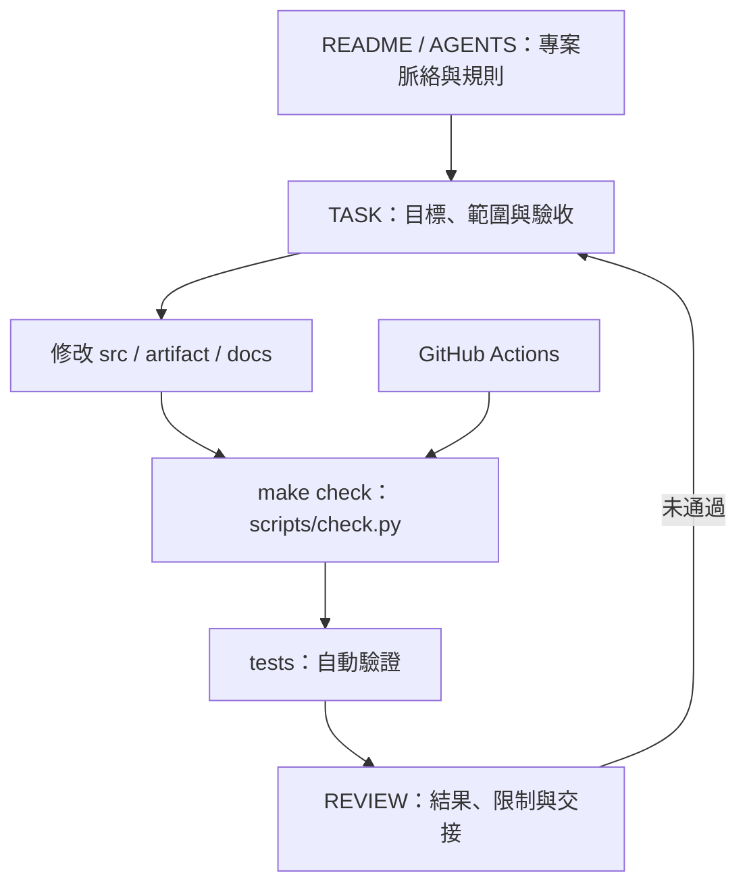

# 基礎 harness

這份 harness 把專案脈絡、任務規格、修改、驗證與審查串成可重複執行的流程。網站使用 Astro + React；Python 處理儲存庫、素材與靜態輸出檢查，Playwright 驗證瀏覽器行為。依賴以鎖定檔及 `npm ci` 安裝，最新驗證與環境限制見 [實作交接](IMPLEMENTATION.md)。

## 架構與責任

| 層次 | 入口 | 責任 |
| --- | --- | --- |
| 專案脈絡 | [README](../README.md)、[AGENTS](../AGENTS.md) | 說明現況、目錄與協作約定 |
| 任務規格 | [TASK](../.agent/TASK.md) | 在修改前寫出目標、假設、範圍及驗收指令 |
| 素材與實作 | [artifact 索引](../artifact/README.md)、[src](../src/) | 保留資料來源，容納後續網站程式碼 |
| 自動驗證 | [檢查入口](../scripts/check.py)、[tests](../tests/) | 執行測試、列出失敗原因並回傳退出碼 |
| 審查與交接 | [REVIEW](../.agent/REVIEW.md)、`.agent/logs/` | 記錄實際結果、未驗證部分與下一步 |

## 一次任務的流程

1. 讀取 `AGENTS.md`、本次需求與相關素材，先查看 `git status --short`；保留既有未提交修改。
2. 依 `TASK.md` 的需求工作；開新任務時可參考 [TASK.template.md](../.agent/TASK.template.md)。把需求轉成能實際檢查的條件，記錄必要假設；若有影響實作方向的未知事項，先釐清。保留使用者在工作期間新增的需求。
3. 做最小範圍修改。修正錯誤時先建立重現方式；新增功能時補上能判斷行為正確與否的檢查。
4. 執行 `make check` 與本次任務需要的額外驗證；失敗時回到修改步驟。需要留存輸出時放在 `.agent/logs/`。
5. 由審查角色填寫 `REVIEW.md`，逐項對照驗收條件、驗證證據與差異；有待修正事項就回到修改步驟。實作角色不可自行寫入核准結果。

`TASK.md` 是目前任務規格；`REVIEW.md` 是目前審查結果。需要保留歷程可交由 Git 版本保存。CI 只檢查審查格式，不會判斷文字內容是否真的達成需求。本次 harness 的驗證證據另存於 [HARNESS_REVIEW.md](../.agent/HARNESS_REVIEW.md)。

## 實作與審查循環

[agent-loop.sh](../agent-loop.sh) 會切換至腳本所在的 Git 根目錄，檢查 `TASK.md`、Makefile、Python 輔助程式及 `codex`、`claude`、`git`、`make`、`python3` 是否存在。真正執行需要已設定登入的 Codex CLI 與 Claude Code；前置檢查不驗證登入或服務連線。可從其他目錄以腳本的完整路徑啟動。

每次呼叫都是新的 CLI 工作，不會自動繼承使用者在其他對話中指定的位置或附件。啟動前將修改要求寫入 TASK，至少交代「頁面／區段、目前問題、預期結果、須保留的內容、驗收方式」；若依截圖指定位置，提供儲存庫內可讀的圖片路徑與區域說明。未保存至 TASK 或可讀素材的對話內容不會自動傳入兩個 agent。

兩個角色均以 TASK 的當前需求及最新使用者回饋為準；歷史任務、舊版頁面分工、舊 REVIEW 核准或舊樣頁等待流程不能覆蓋新需求。具體頁數與內容位置維護於 TASK，不在 shell 提示詞另存一份規格。目前對應「首頁放研究方向；教師介紹整合個人資料、成果、教學與聯絡」、成員名錄及三頁木色風格改版。

- **Codex：實作與前端設計。** 先將每項修改對應到頁面／區段、來源檔案及驗收方式，寫入實作交接；局部修改維持局部範圍，整站改版則完成 TASK 授權的範圍。視覺任務須保存基準畫面、說明構圖／字體／間距／配色／圖片方向、實作並檢視桌面及手機畫面，修正可見問題。交付包含實際路徑、前後畫面、具體改善、檢查結果與限制。
- **Claude：獨立實作與視覺審查。** 逐項核對指定位置、資料完整性、路徑與設計要求，親自檢視本次實作的畫面；不能只看測試通過、CSS 或實作摘要就認定設計完成。缺少必要畫面或無法檢視時回報 `CHANGES_REQUESTED`。問題需指出頁面／區段、尺寸或檔案、實際缺陷、對應需求及修正驗收方式；純偏好放入 Suggestions。

無人值守的循環不能代替使用者確認。若 TASK 允許先交付再確認，reviewer 可在實作、驗證及畫面審查皆達標後核准該次交付，但須明記「使用者視覺確認待完成」，不能宣稱整個任務或使用者驗收完成。尚有效的前置確認條件仍須遵守。工具或權限不足時如實記錄未驗證項目；提示詞不會自動新增瀏覽器能力或放寬執行權限。

`bash agent-loop.sh --review-only` 只執行一次「檢查 → 保存目前差異 → Claude 審查」，不需 Codex CLI，也不執行實作。每次建立新的日誌目錄、重新檢查目前檔案，不讀取先前執行的檢查結果或實作摘要。有效 REVIEW 才會更新正式檔案；`CHANGES_REQUESTED` 回傳 2 並結束，由操作者查看後決定何時啟動一般循環。這個模式可在修正環境或調高回合上限後恢復審查，無須重新實作。

每輪依序進行以下步驟，最多三輪：

1. Codex 讀取 TASK 與上一份有效 REVIEW，執行實作；使用 `codex --ask-for-approval never exec --sandbox workspace-write`。
2. 腳本直接執行 `make check` 並保存退出碼。一般測試失敗仍交 reviewer 提出問題，下一輪可繼續修正；逾時則立即停止。
3. 保存 Git status、未暫存 patch、已暫存 patch，以及未追蹤檔案的 NUL 分隔清單和完整 patch（包括二進位檔）。不包含被 Git 忽略的檔案，並排除 `.agent/logs/`，避免把執行紀錄遞迴加入 patch。不需要已有 HEAD，也不修改 Git index。
4. Claude 以 `plan` 模式審查目前檔案與上述證據，使用 `--output-format json` 保存完整結果。CLI 成功後，由 [Python 輔助程式](../scripts/agent_loop.py) 要求 JSON 為成功的 `result` 物件（`subtype: success`、`is_error: false`），取出非空字串 `result` 寫成候選 Markdown，再驗證格式與檢查退出碼，以同目錄暫存檔及 `os.replace` 替換正式 REVIEW。最終文字不混入工具執行間的進度輸出；若 `result` 本身仍有前言或格式錯誤，照常拒絕，不搜尋或猜測其中的核准字樣。輸出格式依據 [Claude 程式化使用文件](https://code.claude.com/docs/en/headless#get-structured-output)。

`REVIEW.md` 第一行必須是 `APPROVED` 或 `CHANGES_REQUESTED`，後面必須依序包含四個二級標題：`Blocking Issues`、`Important Issues`、`Suggestions`、`Explanation`，每個恰好一次且內容非空。沒有問題時填入 `None`；說明使用繁體中文。只有 reviewer 確認 TASK 當前實作與審查條件達成、必要證據已檢視且沒有 blocking 或 important issues，才可輸出 `APPROVED`；腳本額外要求本輪 `make check` 退出碼為 0。格式驗證不會判斷自然語言意見或視覺品質是否正確，也不取代任務本身的驗收及使用者確認。

初始 REVIEW 保留 `CHANGES_REQUESTED`；實作角色不得改寫或自行核准 REVIEW。Claude 失敗、輸出無效、檢查失敗卻核准，或替換檔案失敗時，都保留上一份有效 REVIEW。備份、Git 證據保存等必要步驟失敗也會停止，不回報成功。

每次啟動會建立唯一的 `.agent/logs/run-時間-隨機字尾/`，並列印完整路徑：

| 檔案 | 用途 |
| --- | --- |
| `review-before.md` | 啟動時既有的 REVIEW 備份（若存在） |
| `codex-N.txt` | Codex 最後訊息；不是完整事件紀錄；review-only 不產生 Codex 檔案 |
| `codex-N.stdout.log`、`codex-N.stderr.log` | Codex 的標準輸出與錯誤輸出 |
| `check-N.log` | `make check` 的合併輸出 |
| `status-N.txt`、`diff-N.patch`、`staged-N.patch` | Git 狀態及兩種追蹤檔案差異 |
| `untracked-N.files`、`untracked-N.patch` | 未追蹤檔案清單及內容差異 |
| `claude-N.stdout.json`、`claude-N.stderr.log` | Claude 的原始標準輸出與錯誤輸出；執行失敗時 stdout 也可能是非 JSON 錯誤文字 |
| `review-N.md` | 從成功 JSON 結果擷取的最終審查文字；仍須通過格式與檢查門檻，擷取失敗時不產生此檔 |
| `review-N.validation.log` | JSON 擷取、審查驗證或替換失敗的原因；失敗時亦顯示於終端機 |

腳本使用 Bash、Git、Make 與 Python 3.9 以上，支援 macOS／Linux，不需要 GNU `timeout` 或第三方 Python 套件。每次 Codex、Claude、`make check` 指令預設逾時 1800 秒；環境變數 `AGENT_TIMEOUT_SECONDS` 接受正整數秒數。逾時會終止該指令的程序群組，必要時強制終止。Claude 每次審查預設最多 30 個內部回合，可用 `CLAUDE_MAX_TURNS` 調整；指定空字串、0、負數或非整數會在啟動指令前拒絕。此上限與外層最多三輪不同，時間與輪數限制都不是金額預算，也不保證 TASK 在時限內完成。

Claude 非零退出時，終端機會列出退出碼、stdout／stderr 的最後 15 行與完整路徑；偵測到 `Error: Reached max turns` 或 JSON 的 `error_max_turns` 會提示調高 `CLAUDE_MAX_TURNS`。錯誤可能寫在原始 `claude-N.stdout.json`，不能只看 stderr。CLI 即使退出 0，失敗結果、損壞／缺欄位 JSON、無效審查仍會停止，保留上一份有效 REVIEW，不會自動略過審查或重試。

退出碼：`0` 表示檢查通過且審查核准；`1` 表示 CLI、檔案保存、格式、核准門檻或逾時錯誤；`2` 表示三輪仍需修改，或 review-only 審查要求修改。停止時保留程式變更，不自動回復工作目錄。同一工作目錄一次執行一個循環；獨立日誌目錄不代表共享程式與 REVIEW 可以並行修改。

`make check` 會在隔離的 Git fixture 中執行循環回歸測試，替換模型及內層 Make 指令；不呼叫真正的模型服務，也不遞迴執行整套檢查。涵蓋回合設定、stdout 錯誤、review-only 的新檢查／差異與原 REVIEW 保護。實際模型審查與網站驗收另記於 [實作交接](IMPLEMENTATION.md)，獨立審查結果見 [REVIEW.md](../.agent/REVIEW.md)。

## 驗證合約

本機與 CI 都執行 `make check`，實際入口為 `python3 scripts/check.py`：

- 從 `tests/` 探索 `test_*.py`，使用標準函式庫 `unittest` 執行。
- Python 測試通過後，執行 Node Markdown／資產測試及 Astro 型別檢查；對根路徑、`/nested/review-lab/` 及實際 `BASE_PATH` 各自執行靜態建置／輸出驗證與 Playwright，最後保留目標路徑的 `dist/`。全部通過才回傳 `0`。失敗、缺少依賴、載入錯誤或找不到測試均回傳非零值。
- 預設檢查必要的 harness 檔案存在且非空。
- 檢查根目錄、`.agent/`（不含 logs）、`docs/`、`artifact/`、`src/`、`tests/` 的 Markdown 為非空 UTF-8，且第一行有一級標題；`REVIEW.md` 改依上述狀態行與區段格式檢查。
- 檢查上述 Markdown 的行內本地連結與圖片目標存在；連結以各文件所在目錄為基準，並限制於專案目錄內。
- 檢查 `artifact/` 的編號 Markdown 素材都有列入索引。
- 在 `tests/test_agent_loop.py` 驗證循環成功／失敗、CLI 參數、Git 證據、審查替換、驗證門檻、日誌及逾時；使用本機替身，不需模型服務。檢查環境另需 Bash 與 Git。
- 在 `tests/test_site.py` 驗證素材與 CONTENT_MAP 映射、來源連結與共用聯絡資料；在 `tests/markdown.test.mjs` 驗證根路徑／多層子路徑、唯一標題錨點、同名檔案隔離及圖片尺寸；在 `tests/assets.test.mjs` 驗證資產清單與複製結果。
- `tests/check_static.py` 檢查實際生成的三個 HTML 頁面、原文內容、導覽／錨點／CSS／JavaScript／圖片路徑，以及圖片位元組一致性、DOCX／Markdown 不公開、全站無下載或編輯提示句。
- `tests/browser/site.spec.mjs` 以 Chromium 檢查桌面與行動版三頁載入、圖片與頁寬、React 選單、Escape、教師頁目錄、hover／鍵盤焦點、無 JavaScript 導覽及 Astro 開發／預覽啟動。測試伺服器只服務本機，正式網站不依賴它。
- Playwright 使用靜態 4322、開發 4324、預覽 4325 埠，`reuseExistingServer: false` 確保不沿用舊伺服器。Astro 測試指令使用 `--ignore-lock`，並指定 `ASTRO_DEV_BACKGROUND=0`／`ASTRO_PREVIEW_BACKGROUND=0`，維持前景程序交給 Playwright 清理，同時保留一般開發伺服器的鎖檔與程序。原因見 [Astro 背景模式](https://docs.astro.build/en/guides/build-with-ai/#background-mode-for-ai-coding-agents)；測試所需本機網路與瀏覽器權限須由執行環境提供。
- `tests/test_static_server.py` 以記憶體內的 HTTP 請求檢查根路徑與子路徑的 GET／HEAD、重新導向與 404；不需開啟 socket。`tests/test_check_command.py` 使用替代命令驗證所有 base 會傳入建置、靜態與瀏覽器檢查，且測試失敗會停止。這兩者都不能取代真實網站驗收。

網路受限或沒有 Node 時，可執行 `make check-source`，僅跑 Python 標準函式庫測試；這個入口不會取得代理循環所要求的完整驗收通過狀態。沒有 Make 時使用 `python3 -m unittest discover -s tests -p 'test_*.py' -v`。

連結檢查僅處理本專案目前採用的行內格式：`[文字](路徑)`、``，以及以角括號包住含空白路徑的寫法。程式碼區塊與行內程式碼略過；不檢查參照式連結、HTML 連結、標題錨點或外部網址。需要這些格式時，再加入 Markdown 解析工具與對應測試。

素材檢查不會推論學術資料真偽或更新時間；內容以 [素材整理說明](../artifact/README.md) 為準。

## CI

[GitHub Actions 設定](../.github/workflows/check.yml) 在 push、pull request 或手動觸發時安裝 Node 24、Python 3.13、npm 依賴與 Chromium，先執行 `bash -n agent-loop.sh`，再執行相同的 `make check`。使用 Ubuntu 與 runner 內建的 Bash、Git、Make，repository 權限為唯讀，不需模型 CLI。兩份工作流程都使用 `npm ci`，要求鎖定檔存在且與套件清單一致。Pages 流程在檢查前設定實際 repository base，故發布目標也會接受瀏覽器檢查。設定檔及鎖定檔需提交並推送到啟用 Actions 的 GitHub repository 才會運行；本機通過不代表遠端 CI 已執行。

Action 用法依據官方 [checkout](https://github.com/actions/checkout) 與 [setup-python](https://github.com/actions/setup-python) 文件。

## 網站後續維護

- 程式放在 `src/`，來源內容在 `artifact/`；新增素材需維護映射與 [CONTENT_MAP](CONTENT_MAP.md)。
- 啟動、安裝、建置與 GitHub Pages 設定見 [README](../README.md)。[Pages 工作流程](../.github/workflows/pages.yml)只由維護者手動觸發，普通 CI 不部署。
- 型別、建置與瀏覽器檢查已整合至 `make check`；最新結果與後續改版範圍見 [實作交接](IMPLEMENTATION.md) 與 TASK。
- 變更依賴時同步更新鎖定檔、README 與 CI；驗證回傳非零時不得視為審查核准。

## R7 功能模組維護與驗證（2026-09-24）

內容與元件入口見 [src 維護說明](../src/README.md)。`src/pages/` 只組裝 `features/home`、`features/faculty`、`features/team`；`shared` 管理導覽、版型、共用聯絡、BASE_PATH 及沒有內容篩選的 Markdown 工具。來源素材一次遷移後留在 artifact 追溯，不再直接渲染，也沒有公開資產複製腳本。CI／依賴及 `make check` 入口不變。

執行 `python3 tests/check_maintenance.py` 可驗證只修改內容就反映於頁面：簡介／研究文字、額外論文、課程、成員及本地圖片、共用電話／地址；使用 try/finally 還原所有內容與 fixture 圖片，重新產生預設子路徑建置。不要與其他建置或內容編輯同時執行。此檢查不代替 make check、畫面與獨立審查。

靜態驗收包含 R2 單段簡介、R4 兩筆學歷與西元期間、R5 返回控制移除、R6 十張本地角色圖片。R6 若缺圖必須回傳非零，不得把 SVG 當成完成或降級為略過。瀏覽器案例擴充 1440×1000、768×1000、375×812；保留無 JavaScript、鍵盤、hover、地圖封鎖及三種 BASE_PATH。實際阻塞與待確認記在 IMPLEMENTATION，不能沿用過去畫面。
